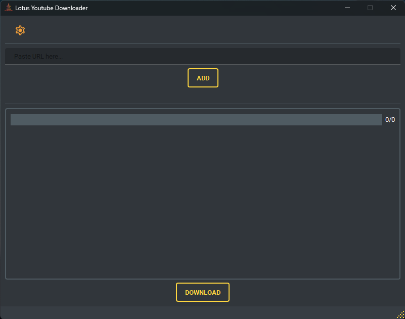

  <picture>
    <source media="(prefers-color-scheme: dark)" srcset="gui\static\img\logo_ydl.png">
    
  </picture>

  <h3> Yet another Music Downloader</h3>

---

This is a simple Youtube Downloader GUI application build in python with PyQt. I built it because I didn't found what I wanted, so made it as simple as possible. _Special thanks to my friends for testing it and giving improvements ideas_ 

  

    <picture>
      <source media="(prefers-color-scheme: dark)" srcset="gui/static/img/dl_dark.png">
      
    </picture>
    <picture>
      <source media="(prefers-color-scheme: dark)" srcset="gui\static\img\dl_white.png">
      
    </picture>
  

  
  

    <picture>
      <source media="(prefers-color-scheme: dark)" srcset="gui\static\img\dl_settings.png"">
      
    </picture>
  

<!-- ## Get the installer
### Simply go to the website [LL Youtube Downloader](https://yt-dl.lunar-lotus.com/) and click on "Download" -->

---
#### Where to get the .exe file ? 
- You can get the exe file [here](https://github.com/LenRenko/lotus-downloader-v2/releases) or click on release on the right
- Extract the archive (with [winrar](https://www.win-rar.com/start.html?L=10) or [7zip](https://www.7-zip.org/download.html)) where you want on your computer
- Go to the folder LotusDownloader and look for the `LotusDownloader_Install_1.0.0.exe`

#### How to use it ?
- Go to youtube and copy the url of your favorite song or video
- Launch with `LotusDownloader.exe`
- Paste your url on the input line, press ENTER or click add to add your url to download list. (works with public or unlisted playlists)
- Do step 1 to 3 again if you want. 
- When you have all your desired urls to download :-> Click DOWNLOAD button and wait for it to download. 

###### Open settings
- To open settings window, click on the gear button on the top left and chose desired options

---
